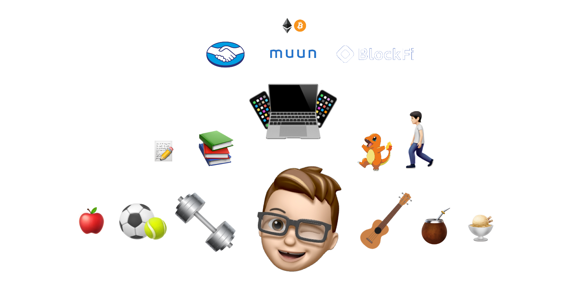

# 👋 Hola 👋

## About me 🤔
- I'm Manu, a human from Argentina 🇦🇷.
- I'm passionate about building software (iOS apps in particular), and I have a weird obsession about open-source code 🤓.
- I'm a 🧉 (mate) fan and if you don't know what that is you need to get in touch with me immediately 😂.
- 😄 Pronouns: He/His.

## Work 👨‍💻
🔷 I'm currently working at [BlockFi](http://blockfi.com) as a Tech Lead in the mobile team. [BlockFi in Github](https://github.com/blockfi).

🔙 I've worked at [muun](https://muun.com) in the past as an iOS & Blockchain Engineer. [muun in Github](https://github.com/muun).

🔙 I've worked at [Mercado Pago](https://www.mercadopago.com) in the past as an iOS Engineer. [Mercado Pago in Github](https://github.com/mercadopago).

## Hobbies 🎾
I enjoy many different activities in my free time:
* 🎾 Playing tennis
* ⚽️ Playing soccer
* 🏋️‍♀️ Going to the gym
* 📚 Reading and being up to date with the industry standards. I maintain an [updated document](https://gist.github.com/mdb1/61e47a010f0def0a290b416266d94d28) with interesting articles.
* 🪕 Playing the Ukulele
* 🚶🏻 Walking
* ⌨️ Working on open-source projects

## Open-Source 📖
Besides the open-source code from the companies that I've worked on, I'm currently working on [SwiftyPick](https://github.com/mdb1/SwiftyPick), a collection of Swift code samples, extensions, functionalities and scripts to cherry-pick and use in your projects.

## Fun fact 🐉
Early in my life I discovered that I had a very odd talent: 

I can remember and write down the first `151` pokemon names without access to the internet in a piece of paper in less than 1 hour.
In order to not lose that talent, I set a reminder to do so once a year.

`June 1st, 2021`: 45 minutes 32 seconds. I had a hard time remembering `Porygon` 😂.

## Ask me about 💬
I enjoy talking a lot, but these are my favorite topics:

| Life | Entertainment | Food | Other |
| - | - | - | - |
| Healthy lifestyle | Sports | Best burgers in town | Software development and processes |
| Humankind history | Cars | Best ice cream in town | Bitcoin history |
| Money management | Dad jokes | Calories | Daily habits and routines |
| Time management | Netflix series | Healthy eating habits | How to document everything in Notion |
| Compound interest | Sudoku techniques | - | The correct way of pouring 🧉 |
| Deliberate practice | Drones | - | - |

## How to reach me 📫
Feel free to shoot me over a DM on [Linkedin](https://www.linkedin.com/in/manuh/).
